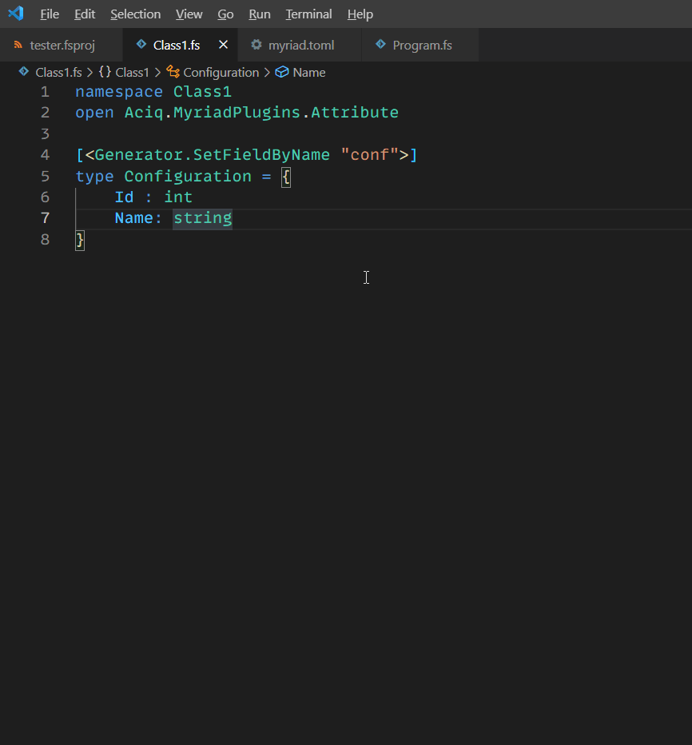

# MyriadPlugins

NOTE: this is a work in progress

## Code generation plugins for Myriad

#### Setup

- add the package reference
- make sure to set GeneratePathProperty to true so the generator finds the plugin 
```xml
<PackageReference Include="Aciq.MyriadPlugins" Version="1.0.0" GeneratePathProperty="true" />
```
- configure a file to be referenced by the plugin e.g.
```xml
<Compile Include="Class1.fs">
    <MyriadInlineGeneration>true</MyriadInlineGeneration>
</Compile>
```
- create a record with a generator attribute
- build the project

## Demo

#### SetFieldByName

- generates record field setters by name
- useful when .NET reflection isn't available like e.g. using Fable




